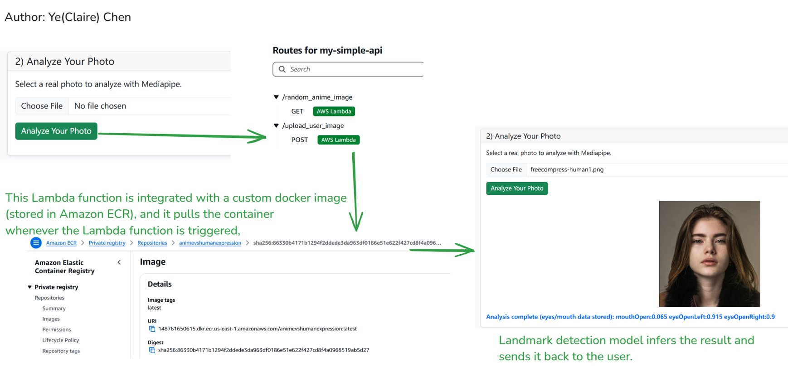
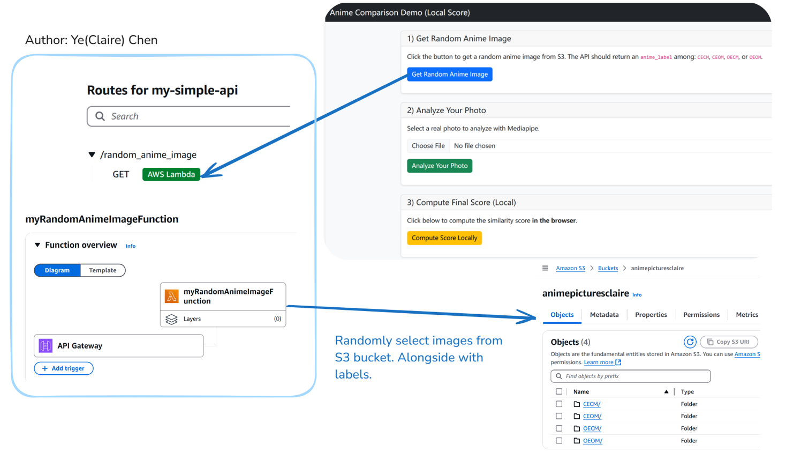
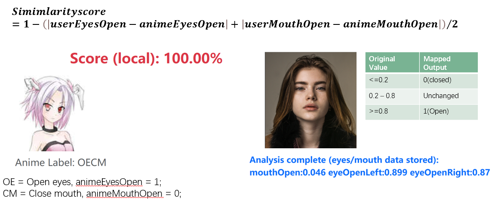

# AniMatch is a AWS based server-less party game demo
This demo using predefined anime labels and mediapipe model for game score calculation.  
As Albert Einstein said, engineers should keep things as simple as possible.  
Thus, we use serverless services to avoiding maintance of whole instance.
## High-Level Architecture
🎯 Step 1: Website select a random anime image from S3;  
📤 Step 2: User uploads his/her own photo;  
🖥️ Step 3: Docker container (Mediapipe) started and return landmark;  
🔢 Step 4: Similarity score computed.  

# Files/Datasets

Datasets source: “Tagged Anime Illustrations” (Kaggle) and Google Custom Search

## Anime image selection
  
The first one handles anime image selection. When a user clicks 'Get Random Anime Image,' an API call triggers an AWS Lambda function.  
The function selects an image from an S3 bucket, where images are organized into labeled folders.  
With the anime image selected, the next step is analyzing human face:  
## Mediapipe docker integration
 
When a user uploads a photo, another AWS Lambda function is triggered.   
It pulls a Docker container— one that we built from scratch, packaged with a Mediapipe model, and then pushed to Amazon ECR.  
Inside this container, the Mediapipe model  identifying key expressions of eye and mouth,  returning these features back.  
At this point, we have both the anime expression and user's landmarks ready, so we can now compute the similarity score.  

## Scoreing Formulation

The logic behind calculation is pretty neat, only by comparing eye and mouth openness.  
The closer the values, the higher the score.  
Given the cross-domain comparison between human faces and anime characters, we map openness values as follows:  
If the value is less than or equal to 0.2, we consider it closed (zero).If the value is greater then or equal to 0.8, we consider it open (one).Everything in between remains unchanged. 
In this case, the user closely matches the anime expression, resulting in a 100% score.
 

# Deployment
In total, two AWS lambda functions, one docker image (pushed to Amazon ECR), 2 S3 buckets(one for anime image store, one for webpage public access), 2 API gateway.

## Lambda: AnimeSelectionCode
Code file can be found in ./AnimeSelectionLmabda_public.py
Note!  
Add your own S3 bucket name:  
BUCKET_NAME = "——yourAnimeImageBucketName——"

## Lambda: Custom Mediapipe Docker integration 
### Docker package
Docker file can be found in folder ./MediapipeDockerRawFiles/  
Highly recommend user to compile in EC2 instance to reduce incomplicity, since lambda funcion's original environemt is EC2.
### Push to AWS ECR
Command can be found in https://docs.aws.amazon.com/AmazonECR/latest/userguide/docker-push-ecr-image.html.

## Frontend page 
Frontend page can be found in ./index-noprivacy.html

### HTTP API 
We use HTTP API to trigger Lambda function, so please remember to create two API Gateways.  

NOTE!  
Add your own api in index.html:  
const RANDOM_ANIME_API = "————your_lambda_link————";  
const MEDIAPIPE_API    = "————your_lambda_link————";  

# What's more  
## Identification of Mediapipe landmark

# Mediapipe Face Geometry - Mouth Region Analysis

The following image is from the Mediapipe repository:

[**canonical_face_model_uv_visualization.png**](https://github.com/google-ai-edge/mediapipe/blob/a908d668c730da128dfa8d9f6bd25d519d006692/mediapipe/modules/face_geometry/data/canonical_face_model_uv_visualization.png)  
_Source: [google-ai-edge/mediapipe](https://github.com/google-ai-edge/mediapipe)_

## Mouth Region:

### Left and Right Points:
- **Index 78**: (x = 0.4555, y = 0.3861, z = 0.0045)
- **Index 308**: (x = 0.5305, y = 0.3822, z = 0.0074)

### Upper and Lower Points:
- **Index 13**: (x = 0.4961, y = 0.3873, z = -0.0112)
- **Index 14**: (x = 0.4960, y = 0.3874, z = -0.0129)

## Mouth Open Calculation:

The **mouthOpen** logic has been implemented since the **BlendShape-based mouthClose** detection was inaccurate. Instead, the mouth openness is calculated directly using **facemask indices**, similar to how it is done in animation.

### Calculation Logic:
Mouth openness is determined by the **vertical distance between the upper and lower lips** divided by the **horizontal distance between the left and right corners of the mouth**.

